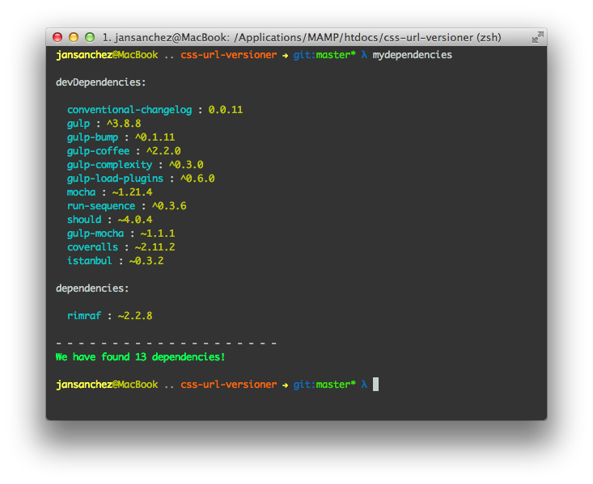
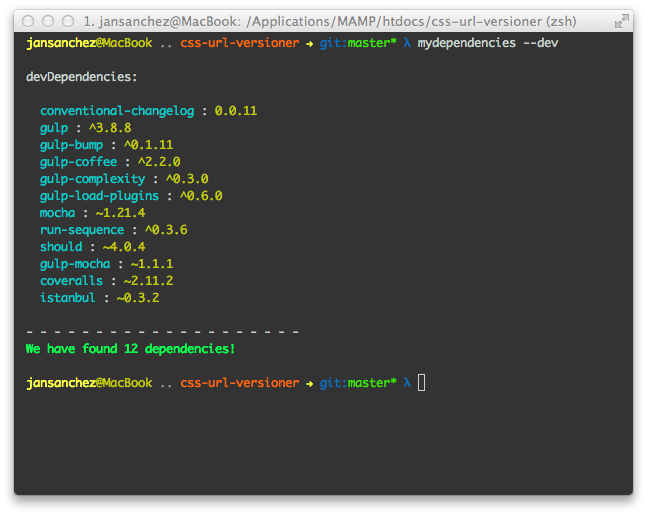
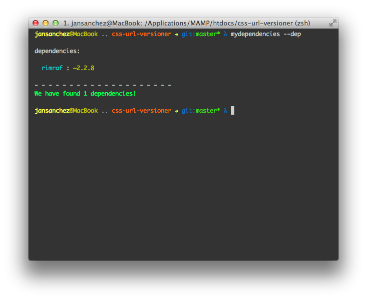
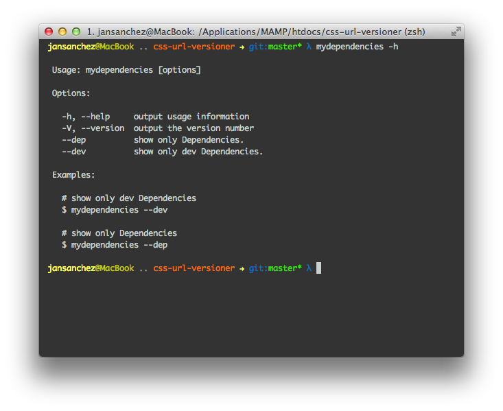

# MyDependencies [![NPM version][npm-image]][npm-url] [![Build Status][travis-image]][travis-url] [![Coveralls Status][coveralls-image]][coveralls-url] [![Code Climate Status][codeclimate-image]][codeclimate-url] 

> Reader dependencies from package.json on terminal

## Getting Started

### Install:

```
npm install -g mydependencies
```

### How to use:

```
mydependencies
```



```
mydependencies --dev
```



```
mydependencies --dep
```



```
mydependencies -h
```



[downloads-image]: http://img.shields.io/npm/dm/mydependencies.svg
[npm-url]: https://www.npmjs.org/package/mydependencies
[npm-image]: http://img.shields.io/npm/v/mydependencies.svg

[travis-url]: https://travis-ci.org/jansanchez/mydependencies
[travis-image]: http://img.shields.io/travis/jansanchez/mydependencies.svg

[coveralls-url]: https://coveralls.io/r/jansanchez/mydependencies
[coveralls-image]: https://img.shields.io/coveralls/jansanchez/mydependencies.svg

[codeship-url]: https://www.codeship.io/projects/44868
[codeship-image]: https://codeship.io/projects/221e0440-44c9-0132-43bc-1e738e05cfd5/status?branch=master

[codeclimate-url]: https://codeclimate.com/github/jansanchez/mydependencies
[codeclimate-image]: https://codeclimate.com/github/jansanchez/mydependencies/badges/gpa.svg


